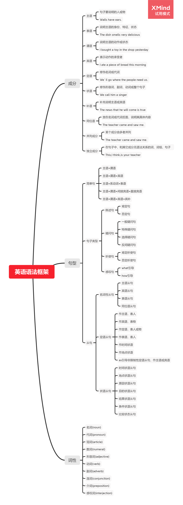

# 语法

## 前言

10+9+8 语法体系

## 内容

- 词性
- 句型
- 成份

10+9+8 语法体系，10 指的是 10 种词性，9 指的是 9 种句子成份，8 指的是 8 种句型

10 种词性：介词、冠词、名词、代词、数词、副词、形容词、动词、连词、感叹词

9 种句子成份：主语、谓语、宾语、表语、双宾语、同位语、宾补、定语、状语

8 种句型：

1. 主+谓+宾
2. 主+系+表
3. 主+谓+间宾+直宾
4. 主+谓+宾+宾补
5. 主+谓
6. 名词性从句
7. 定语从句
8. 状语从句

### 一、词性

- 介词
- 冠词
- 名词
- 代词
- 数词
- 副词
- 形容词
- 动词
- 连词
- 感叹词

### 二、句子成份

### 2.1 基本句型

1. Subject(主语)+Verb(谓语)

主谓句型中的动词大多是不及物动词，所谓不及物动词，就是这种动词后不可以直接宾语。

常见的动词如：work,sing,swim,fish,jump,arrive,come,die,disappear,cry,happen 等。

例如：

LiMingworksveryhard.李明学习很努力。

2. Subject(主语)+Link.V(系动词)+Predicate(表语)

主系表句型主要用来表示主语的特点、身份等。其系动词一般可分为下列两类：

表示状态。这样的词有：be,look,seem,smell,taste,sound,keep 等。

表示变化。这类系动词有：become,turn,get,grow,go 等。

3. Subject(主语)＋ Verb(谓语)＋ Object(宾语)

主谓宾句型中的动词一般为及物动词,所谓及物动词，就是这种动词后可以直接接宾语，其宾语通常由名词、代词、动词不定式、动名词或从句等来充当。

4. Subject(主语)＋ Verb(谓语)＋ Indirectobject(间接宾语)＋ Directobject(直接宾语)

主谓双宾句型中，直接宾语为主要宾语，表示动作是对谁做的或为谁做的，在句中不可或缺，常常由表示“物”的名词来充当；间接宾语也被称之为第二宾语，去掉之后，对整个句子的影响不大，多由指“人”的名词或代词承担。

引导这类双宾语的常见动词有：buy,pass,lend,give,tell,teach,show,bring,send 等。

5. Subject(主语)＋ Verb(动词)＋ Object(宾语)＋ Complement(补语)

主谓宾补句型中的“宾语＋补语”统称为“复合宾语”。宾语补足语的主要作用或者是补充、说明宾语的特点、身份等；或者表示让宾语去完成的动作等。

担任补语的常常是名词、形容词、副词、介词短语、分词、动词不定式等。

#### 2.2 类型

- 陈述句：肯定句、否定句
- 疑问句：一般疑问句、特殊疑问句、选择疑问句、反间疑问句
- 祈使句：
- 感叹句：

#### 2.3 从句

- 名词性从句：主语从句、宾语从句、表语从句、同位语从句
- 定语从句：作主语（表人）、作宾语（表物）、作定语（表人或物）、作表语（表人）
- 状语从句：时间状语从句、地点状态从句、原因状语从句、目的状语从句、结果状语从句、条件状态从句、比较状语从句、让步状语从句、方式状语从句

### 三、成份

### 四、思维导图

### 参考资料

- [几个小时才勉强把语法讲清楚](https://www.zhihu.com/question/30030877/answer/943229121)